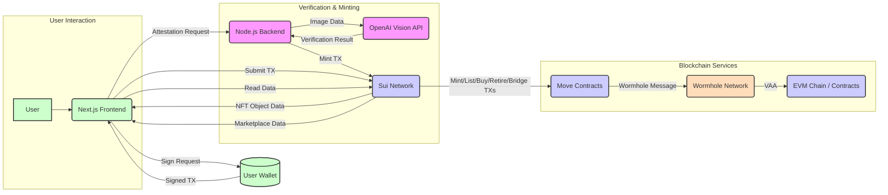
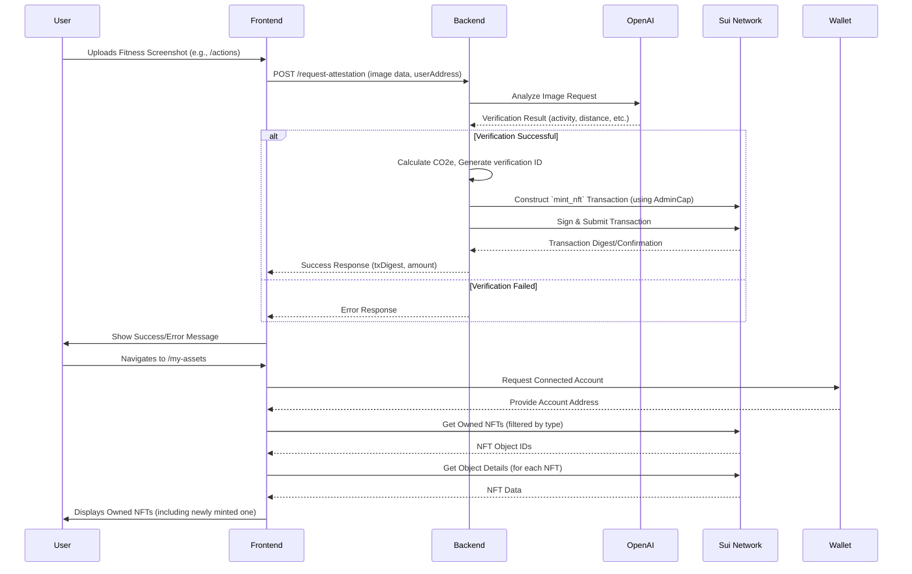
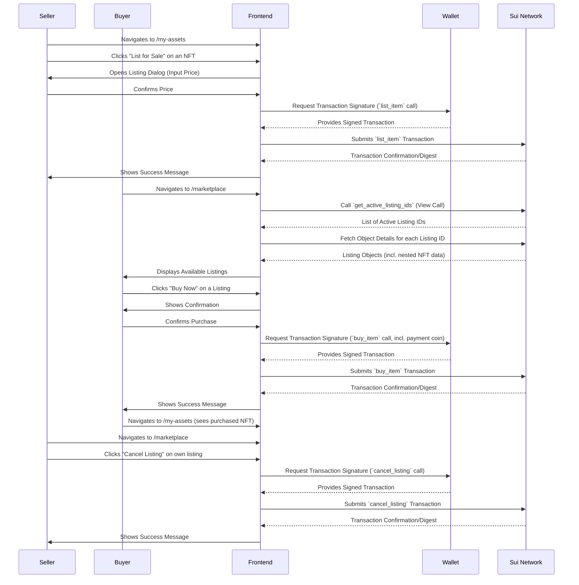
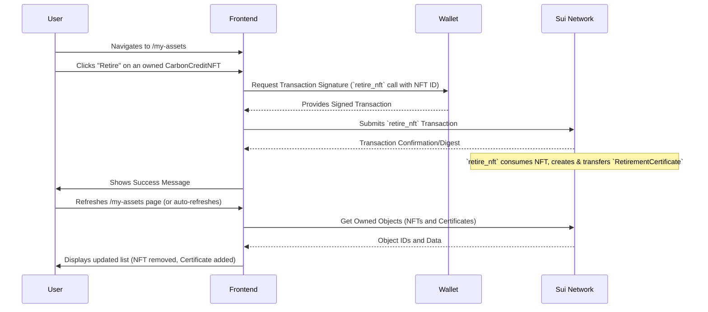
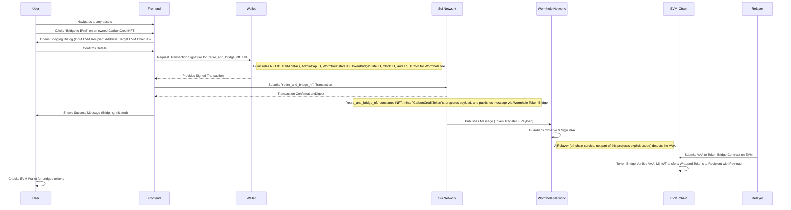

# Sui Cross Chain Carbon Marketplace

This project demonstrates a decentralized platform for tokenizing real-world assets (RWAs)—specifically verified carbon credits earned through sustainable transportation—as Non-Fungible Tokens (NFTs) on the Sui network. The platform features Move smart contracts for on-chain logic, a Node.js/Express backend for off-chain data verification (e.g., using AI for image analysis) and automated minting, and a Next.js frontend for seamless user interaction. A key feature is its cross-chain capability, leveraging Wormhole to enable the bridging of these tokenized carbon credits (or their equivalent value) from Sui to EVM-compatible blockchains, expanding their utility and reach.

## Project Goal

To create a decentralized application where users can:
1.  Submit proof of sustainable transport activities (e.g., cycling, walking screenshots from fitness apps).
2.  Have the proof verified off-chain using AI (OpenAI Vision).
3.  Receive a unique `CarbonCreditNFT` on the Sui network representing the verified carbon offset.
4.  View their owned NFTs.
5.  List their NFTs for sale on a simple marketplace.
6.  Browse and purchase listed NFTs using Sui tokens.
7.  Retire (burn) their NFTs to claim the offset.
8.  Receive an on-chain `RetirementCertificate` as proof after retiring an NFT.
9.  Bridge the value of their `CarbonCreditNFT`s as fungible tokens to an EVM-compatible chain using Wormhole.

## Technology Stack

*   **Blockchain:** Sui
*   **Smart Contracts:** Move
*   **Backend:** Node.js, Express, TypeScript, OpenAI API
*   **Frontend:** Next.js, React, TypeScript, Tailwind CSS, Shadcn UI
*   **Package Manager:** pnpm
*   **Bridging:** Wormhole

## Project Structure

```
.
├── backend/         # Node.js/Express backend server
│   ├── src/
│   ├── .env.example # Example environment variables
│   └── ...
├── contracts/       # Move smart contracts
│   └── rwa_platform/
│       ├── sources/ # Move source files (.move)
│       ├── tests/   # Move unit tests (partially implemented)
│       └── Move.toml
|   └── evm/
│       ├── src/     # EVM smart contract
├── frontend/        # Next.js frontend application
│   ├── app/
│   ├── components/
│   ├── public/      # Static assets (images)
│   ├── .env.local   # Frontend environment variables (local)
│   └── ...
├── .gitignore
└── README.md
```

## Architecture Overview


The platform integrates Wormhole to enable cross-chain bridging of tokenized carbon credits from Sui to EVM-compatible networks.

## Key Flows

### 1. NFT Minting Flow



### 2. Marketplace Flow (Listing & Buying)



### 3. NFT Retirement Flow



### 4. NFT Bridging Flow (Sui to EVM via Wormhole)



## Setup Instructions

1.  **Clone the Repository:**
    ```bash
    git clone <repository_url>
    cd sui-cross-chain-carbon-marketplace
    ```

3.  **Backend Setup:**
    ```bash
    cd backend
    pnpm install
    cp .env.example .env
    ```
    *   Edit `.env` and fill in the required values:
        *   `OPENAI_API_KEY`: Your OpenAI API key.
        *   `SUI_NODE_URL`: URL of the SuiJSON-RPC endpoint.
        *   `SUI_PACKAGE_ID`: Deployed Move package ID (initially blank).
        *   `SUI_ADMIN_CAP_ID`: Deployed `AdminCap` object ID (initially blank).
        *   `SUI_VERIFICATION_REGISTRY_ID`: Deployed `VerificationRegistry` object ID (initially blank).
        *   `SUI_DEPLOYER_PRIVATE_KEY`: **Private key** of the account that will hold the `AdminCap` and mint NFTs. Keep this secure!
        *   `PROVIDER_PORT`: Port for the backend server (default 3001).
        *   `SUI_WORMHOLE_STATE_ID`: Object ID of the Wormhole State object on Sui (e.g., from Wormhole documentation for the target network).
        *   `SUI_TOKEN_BRIDGE_STATE_ID`: Object ID of the Token Bridge State object on Sui (e.g., from Wormhole documentation).
        *   `SUI_CLOCK_OBJECT_ID`: Object ID of the shared Clock object on Sui (usually `0x6`).

4.  **Frontend Setup:**
    ```bash
    cd ../frontend
    pnpm install
    # Create .env.local from example if it doesn't exist, or just create it.
    touch .env.local
    ```
    *   Edit `.env.local` and fill in the required values:
        *   `NEXT_PUBLIC_SUI_NODE_URL`: URL of the Sui JSON-RPC endpoint (can be the same as backend).
        *   `NEXT_PUBLIC_PACKAGE_ID`: Deployed Move package ID (initially blank).
        *   `NEXT_PUBLIC_MARKETPLACE_PACKAGE_ID`: Deployed Move package ID (usually same as above).
        *   `NEXT_PUBLIC_DISPLAY_OBJECT_ID`: Deployed NFT `Display` object ID (initially blank).
        *   `NEXT_PUBLIC_LISTING_REGISTRY_ID`: Deployed `ListingRegistry` object ID (initially blank).
        *   `NEXT_PUBLIC_BACKEND_URL`: URL of your running backend server (e.g., `http://localhost:3001`).
        *   `NEXT_PUBLIC_WORMHOLE_STATE_ID`: Object ID of the Wormhole State object on Sui.
        *   `NEXT_PUBLIC_TOKEN_BRIDGE_STATE_ID`: Object ID of the Token Bridge State object on Sui.
        *   `NEXT_PUBLIC_CLOCK_OBJECT_ID`: Object ID of the shared Clock object on Sui (usually `0x6`).
        *   `NEXT_PUBLIC_ADMIN_CAP_ID`: Deployed `AdminCap` object ID (needed by frontend to construct `retire_and_bridge_nft` calls).

## Deployment Instructions

1.  **Deploy Move Contracts:**
    *   Navigate to the contracts directory: `cd ../contracts/rwa_platform`
    *   Compile the contracts:
        ```bash
        sui move build # Use build instead of compile for newer Sui CLI versions
        ```
    *   Deploy the package (this requires your configured CLI wallet to have gas funds):
        ```bash
        # This command will output the deployed package ID and created objects
        sui client publish --gas-budget 300000000 # Increased gas budget for publish
        ```
    *   **Record the Output:** Note down the `Package ID`, the `AdminCap` object ID, and the `VerificationRegistry` object ID printed after successful deployment. (The `ListingRegistry` ID comes from the marketplace module if it's separate, otherwise it might be part of this package too).
    *   **Update Backend `.env`:** Fill in `SUI_PACKAGE_ID`, `SUI_ADMIN_CAP_ID`, `SUI_VERIFICATION_REGISTRY_ID` with the recorded values. Also, set `SUI_WORMHOLE_STATE_ID`, `SUI_TOKEN_BRIDGE_STATE_ID`, and `SUI_CLOCK_OBJECT_ID` based on the Sui network you are targeting (e.g., Sui Testnet, Mainnet - these are standard Wormhole deployment object IDs).
    *   **Update Frontend `.env.local`:** Fill in `NEXT_PUBLIC_PACKAGE_ID`, `NEXT_PUBLIC_MARKETPLACE_PACKAGE_ID`, `NEXT_PUBLIC_LISTING_REGISTRY_ID` (if applicable), `NEXT_PUBLIC_ADMIN_CAP_ID`, `NEXT_PUBLIC_WORMHOLE_STATE_ID`, `NEXT_PUBLIC_TOKEN_BRIDGE_STATE_ID`, and `NEXT_PUBLIC_CLOCK_OBJECT_ID`.

2.  **Setup Bridge Admin Capabilities:**
    *   After deploying your package and obtaining your `AdminCap` ID, and knowing the Wormhole/TokenBridge State object IDs for your target Sui network, call the `setup_bridge_admin` function in your `carbon_nft_manager` module. This initializes the `AdminCap` with the necessary Wormhole EmitterCap.
        ```bash
        sui client call \\
            --package <YOUR_PACKAGE_ID> \\
            --module carbon_nft_manager \\
            --function setup_bridge_admin \\
            --args <YOUR_ADMIN_CAP_ID> <WORMHOLE_STATE_OBJECT_ID> <TOKEN_BRIDGE_STATE_OBJECT_ID> <WORMHOLE_STATE_OBJECT_ID_FOR_EMITTER_ARG> \\
            --gas-budget 30000000
        ```
    *   Note: `<WORMHOLE_STATE_OBJECT_ID_FOR_EMITTER_ARG>` is the same Wormhole State Object ID, passed as the required object argument for `emitter::new`.

3.  **Create NFT Display Object:**
    *   The `Display` object makes NFT collections discoverable by wallets/explorers. It must be created in a separate transaction *after* deployment using the `Publisher` object created during `init`.
    *   First, find the `Publisher` object ID owned by the deployer account (you can use an explorer or the output from the `sui client publish` command, typically under "createdObjects").
    *   Execute the `create_nft_display` function using the CLI (ensure your module has this function, or `create_display` if that's its name):
        ```bash
        sui client call \\
            --package <YOUR_PACKAGE_ID> \\
            --module carbon_nft_manager \\
            --function create_nft_display \\
            --args <YOUR_PUBLISHER_OBJECT_ID> \\
            --gas-budget 30000000 
        ```
    *   **Record the Output:** Note down the `Display<...CarbonCreditNFT>` object ID created by this call.
    *   **Update Frontend `.env.local`:** Fill in `NEXT_PUBLIC_DISPLAY_OBJECT_ID` with the recorded value.

4.  **Deploy EVM Contract (Placeholder):**
    *   The `contracts/evm/src/` directory contains a placeholder for your EVM contract that would receive the bridged tokens and handle the custom payload.
    *   Deploy this contract to your target EVM chain (e.g., Ethereum Sepolia, Polygon Mumbai).
    *   You would need to configure this EVM contract to be a "token receiver" with the Wormhole Token Bridge on the EVM side, allowing it to process messages containing your custom payload. This setup is specific to Wormhole's EVM SDK and documentation.

5.  **Run Backend Server:**
    ```bash
    cd ../../backend # Navigate back to backend directory
    pnpm dev # Or pnpm start for production build
    ```
    *   The server should start on the port specified in `.env` (default 3001).

6.  **Run Frontend Application:**
    ```bash
    cd ../frontend # Navigate back to frontend directory
    pnpm dev
    ```
    *   The frontend should be accessible at `http://localhost:3000` (or another port if 3000 is busy).

## Testing Instructions

1.  **Backend:**
    *   Currently, no automated tests are implemented.
    *   **Manual Testing:** Use tools like `curl` or Postman to send requests to the `/request-attestation` endpoint with valid/invalid data (including a base64 encoded image string) and observe the console output and blockchain interactions.

2.  **Frontend:**
    *   **Manual Testing:**
        *   Connect an Sui wallet (ensure it has >1 coin object).
        *   Navigate through the pages: "Actions", "My Assets", "Marketplace".
        *   **Actions:** Upload a fitness screenshot, submit the request, and verify if an NFT appears in "My Assets" after a short delay. Check backend logs for OpenAI/minting status.
        *   **My Assets:** Verify owned NFTs are displayed correctly (image based on type, data). Test the "Retire" functionality - **verify the NFT disappears and a corresponding `RetirementCertificate` appears in the new section below**. Test the "List for Sale" button opens the dialog.
        *   **Listing Dialog:** Enter a price and submit. Check the marketplace page afterwards.
        *   **Marketplace:** Verify listed items appear. Test the "Buy Now" button (using a different account than the seller). Test the "Cancel Listing" button for items you listed. Check your wallet balance changes and NFT ownership transfers.
    *   **Wallet Interaction:** Test connecting/disconnecting the wallet. Test transaction signing prompts.
    *   **Gas Requirement:** Test the "Buy Now" flow with a wallet containing only one coin object - verify the correct error message appears instructing the user to split the coin.

## Important Notes

*   **Gas Coins:** The Sui network **requires a separate coin object for gas payment**. You cannot use a single coin object to both pay gas and be the input for an operation (like splitting or transferring the full balance) in the same transaction. Users *must* have at least two coin objects in their wallet to perform most actions (buying, listing, retiring).
*   **Security:** The `SUI_DEPLOYER_PRIVATE_KEY` in the backend `.env` grants minting capabilities. **Protect this key rigorously.** In a production scenario, consider using a more robust key management solution (e.g., HSM, KMS).
*   **Error Handling:** Frontend and backend error handling can be further improved for edge cases and user feedback.
*   **OpenAI Costs:** Using the OpenAI Vision API incurs costs. Monitor your usage.
*   **Image Placeholders:** Replace the placeholder image paths in the frontend constants (`CYCLING_IMAGE_URL`, etc.) with actual URLs or ensure corresponding files exist in `frontend/public/images/`.
